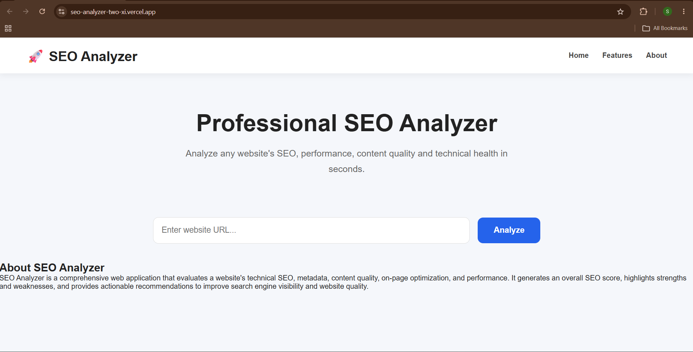
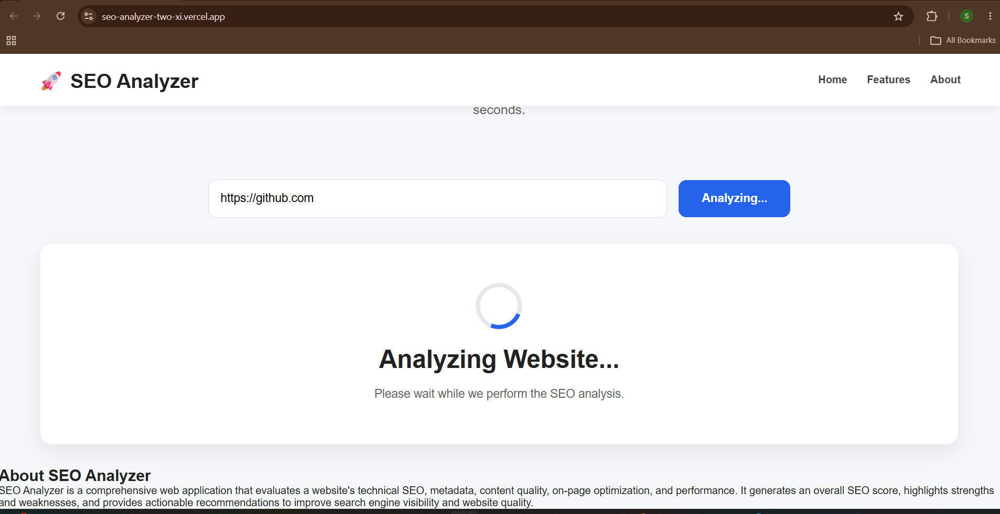
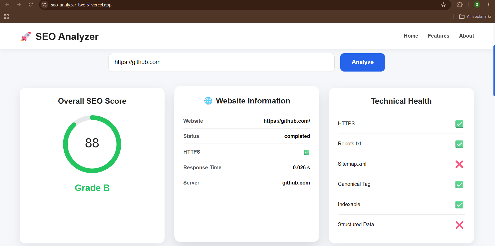
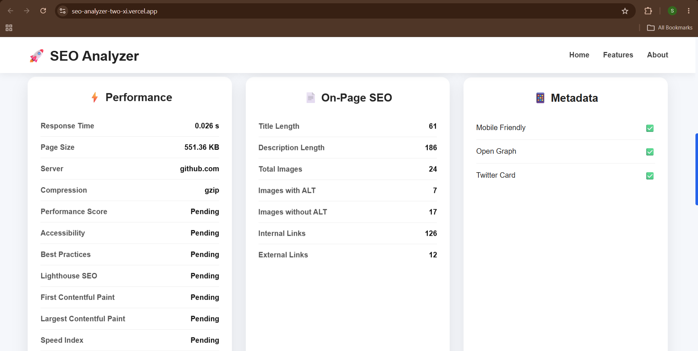
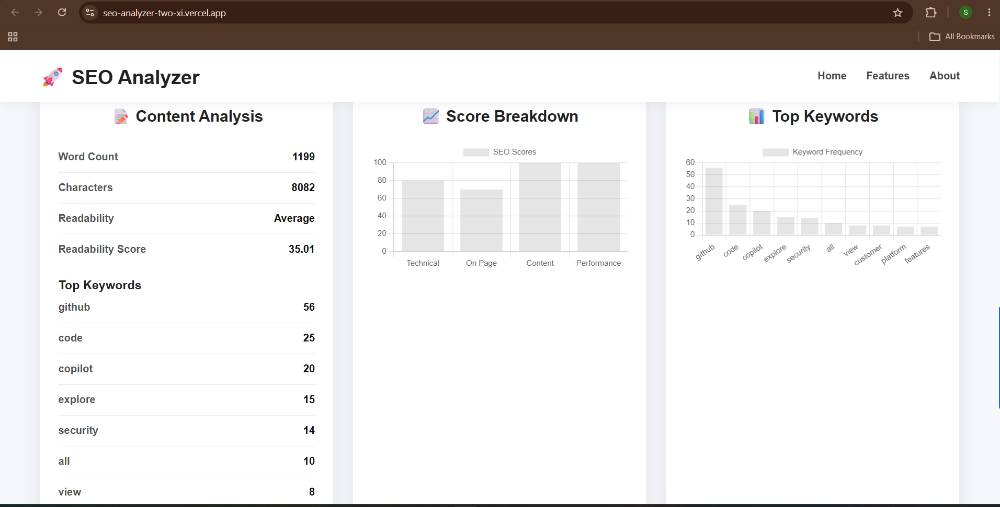

# 🚀 SEO Analyzer

<p align="center">

A modern Full Stack SEO Analysis Web Application built with **React**, **FastAPI**, **SQLAlchemy**, and **BeautifulSoup**, capable of analyzing websites for Technical SEO, Metadata, Content Quality, Performance, and providing actionable SEO recommendations.

</p>

---

## 🌐 Live Demo

### Frontend
https://seo-analyzer-two-xi.vercel.app

### Backend API
https://seo-analyzer-lbi9.onrender.com

---

# ✨ Features

## 🔍 Website Analysis

- Website Information
- Domain Extraction
- HTTP Status
- Response Time
- Page Size
- Compression Detection

---

## 📑 Metadata Analysis

- Title Tag
- Meta Description
- Meta Keywords
- Canonical Tag
- Open Graph Tags
- Twitter Cards

---

## ⚙ Technical SEO

- HTTPS Detection
- Robots.txt
- Sitemap.xml
- Structured Data
- Canonical URL
- Indexability
- Security Headers

---

## 📝 Content Analysis

- Word Count
- Character Count
- Readability Score
- Keyword Frequency
- Top Keywords

---

## 📈 SEO Score

- Overall SEO Score
- Technical Score
- Metadata Score
- Content Score
- Performance Score
- Recommendations

---

## 📊 Interactive Dashboard

- Score Charts
- Keyword Frequency Charts
- Technical Health Panel
- Website Information
- Responsive UI

---

# 🛠 Tech Stack

## Frontend

- React.js
- Axios
- Chart.js
- CSS3

## Backend

- FastAPI
- SQLAlchemy
- SQLite
- BeautifulSoup4
- Requests

## Performance

- Lighthouse
- Chromium
- Node.js

## Deployment

- Vercel
- Render

---

# 📂 Project Structure

```text
seo-analyzer/

├── frontend/
│   ├── src/
│   │   ├── components/
│   │   ├── charts/
│   │   ├── pages/
│   │   ├── services/
│   │   └── styles/
│   └── package.json
│
├── backend/
│   ├── app/
│   │   ├── models/
│   │   ├── routes/
│   │   ├── schemas/
│   │   ├── services/
│   │   └── database.py
│   │
│   ├── lighthouse_runner.js
│   ├── requirements.txt
│   ├── package.json
│   └── Dockerfile
│
└── README.md
```

---

# ⚙ Installation

## Clone Repository

```bash
git clone https://github.com/Swagat-01-sys/seo-analyzer.git

cd seo-analyzer
```

---

## Backend

```bash
cd backend

pip install -r requirements.txt

npm install

uvicorn app.main:app --reload
```

Swagger API

```
https://seo-analyzer-lbi9.onrender.com/docs
```

---

## Frontend

```bash
cd frontend

npm install

npm run dev
```

Live Application

```
https://seo-analyzer-two-xi.vercel.app
```

# 📷 Screenshots

## 🏠 Home Page



---

## ⏳ Analysis in Progress



---

## 📊 Dashboard



---

## 📈 SEO Analysis



---

## 📋 Detailed Report


---

## ℹ About



---

# 📊 SEO Modules

✅ Metadata Analysis

✅ Technical SEO

✅ Content Analysis

✅ Website Information

✅ Performance Analysis

✅ Recommendations Engine

✅ Score Generation

✅ Keyword Analysis

---

# ⚠ Lighthouse Integration Status

The project includes **Google Lighthouse** integration for advanced website performance analysis.

### Local Development

✔ Lighthouse executes successfully using Chromium and Node.js.

### Production Deployment

The application is currently deployed on the **Render Free Tier**.

Because Render Free containers experience cold starts and limited execution resources, launching Chromium for Lighthouse audits may not always complete successfully.

As a result, the following metrics may temporarily display **"Pending"** in the live demo:

- Performance Score
- Accessibility
- Best Practices
- SEO Score
- First Contentful Paint (FCP)
- Largest Contentful Paint (LCP)
- Speed Index
- Total Blocking Time (TBT)
- Cumulative Layout Shift (CLS)

This limitation affects only Lighthouse metrics.

All other SEO analysis modules—including metadata analysis, technical SEO checks, content analysis, scoring, recommendations, and visualizations—are fully functional in production.

---

# 🚀 Future Improvements

- Production-ready Lighthouse integration
- PDF SEO Reports
- Analysis History
- Website Comparison
- AI-powered SEO Suggestions
- Dark Mode
- Multi-page Website Crawling
- User Authentication

---

# 👨‍💻 Author

 Swagata Chowdhury

B.Tech Computer Science Engineering

Built using **React**, **FastAPI**, **SQLAlchemy**, **BeautifulSoup**, **Chart.js**, and **Modern Web Technologies**.

---

⭐ If you found this project useful, consider giving it a Star.